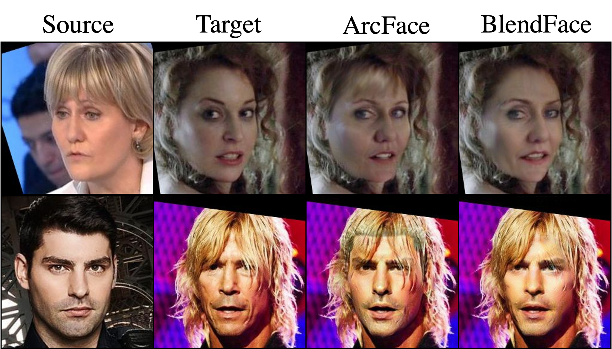

# BlendFace (ICCV2023)
<a href='https://arxiv.org/abs/2307.10854'></a> &nbsp; 
<a href='https://mapooon.github.io/BlendFacePage'></a> &nbsp; 

The official PyTorch implementation for the following paper:
> [**BlendFace: Re-designing Identity Encoders for Face-Swapping**](https://arxiv.org/abs/2307.10854),  
> Kaede Shiohara, Xingchao Yang, Takafumi Taketomi,   
> *ICCV 2023*

# Attention
This project is only for research purpose. Please do not apply it to illegal and unethical scenarios.  
The code is distributed under the CC BY-NC-SA 4.0 license.

# Changelog
2023/09/22: Released training code for BlendFace. 
2023/09/09: Released demo code and model for face-swapping.  
2023/07/21: Released demo code and pretrained models.

# Recomended Development Environment
* GPU: NVIDIA A100
* CUDA: 11.4


# Installation
## Docker
(1) Pull a docker image from docker hub:
```bash
docker pull pytorch/pytorch:1.13.1-cuda11.6-cudnn8-runtime
```
(2) Replace the absolute path to this repository in `./exec.sh`.  
(3) Execute the image:
```bash
bash exec.sh
```

## Pretrained Models
We provide trained models for [ArcFace](https://drive.google.com/file/d/1wFkGXI36lZZQpOeIuM_0BxX2rIYSIA1K/view?usp=sharing) and [BlendFace](https://drive.google.com/file/d/1FSCUC5CbyPKnl5Bbt58tPcKCVOyyt004/view?usp=sharing) and place them to ```checkpoints/```.

# Demo  


We provide a demo code to compute identity similarities of ArcFace and BlendFace for an actual positive pair (```images/anchor.png``` and ```images/positive.png```), negative pair (```images/anchor.png``` and ```images/negative.png```), and pseudo-positive pair (```images/anchor.png``` and ```images/swapped.png```).
```python3
python3 demo.py
```
The result will be displayed as follows:
```python
> ArcFace| Positive: 0.7967, Negative: 0.0316, Swapped: 0.6212
> BlendFace| Positive: 0.8186, Negative: -0.0497, Swapped: 0.8015
```
It can be seen that ArcFace underestimates the similarity for the pseudo-positive pair while BlendFace predicts properly it, which indicates BlendFace mitigates the biases while keeping the discriminativeness for the negative sample.


# Face-Swapping  


We also provide code for face-swapping (AEI-Net + BlendFace). The pretrained checkpoint is [here](https://drive.google.com/file/d/1ssTKnNVGomtrtPl57EOGzKNz62bh6mSs/view?usp=sharing).  
Move to `/workspace/swapping`.
```bash
cd /workspace/swapping
```
Swap target face with source face:
```python
python3 inference.py \
    -w checkpoints/blendswap.pth \ # path to checkpoint
    -s examples/source.png \ # path to source image
    -t examples/target.png \ # path to target image
    -o examples/output.png # path to output image
```
Note: source images should be aligned following [InsightFace](https://github.com/deepinsight/insightface/blob/master/python-package/insightface/utils/face_align.py) and target images should be aligned following [FFHQ](https://github.com/happy-jihye/FFHQ-Alignment).


# Training BlendFace
Please see [`training/README.md`](https://github.com/mapooon/BlendFace/tree/master/training).


# Acknowledgements
We borrow some code from [InsightFace](https://github.com/deepinsight/insightface) and [FaceShifter](https://github.com/mindslab-ai/faceshifter) (unofficial).


# Citation
If you find our work useful for your research, please consider citing our paper:
```bibtex
@inproceedings{shiohara2023blendface,
  title={BlendFace: Re-designing Identity Encoders for Face-Swapping},
  author={Shiohara, Kaede and Yang, Xingchao and Taketomi, Takafumi},
  booktitle={Proceedings of the IEEE/CVF International Conference on Computer Vision (ICCV)},
  year={2023}
}
```